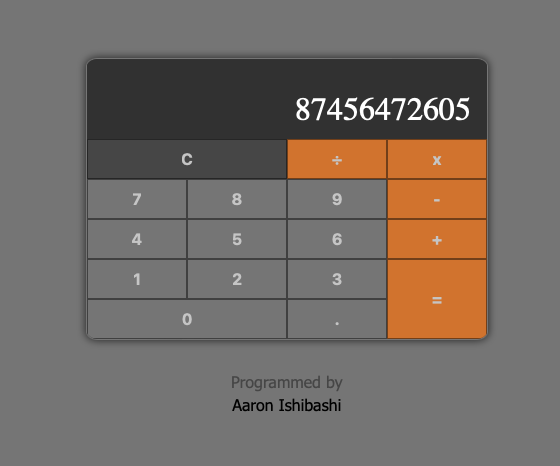

# Calculator App

This is a calculator app that runs in a web browser, created for a freeCodeCamp front-end APIs certificate assignment. 

Please check out the build [here](https://aaronishibashi.com/portfolio/web/calculator/)

### Tools
- React, front-end management
- TypeScript, JS pre-processor
- Stylus, CSS pre-processor
- Jest, unit tests
- Webpack, bundling

### Build
Run `npm run build`
Then run a live server in the "dist" directory to open index.html
